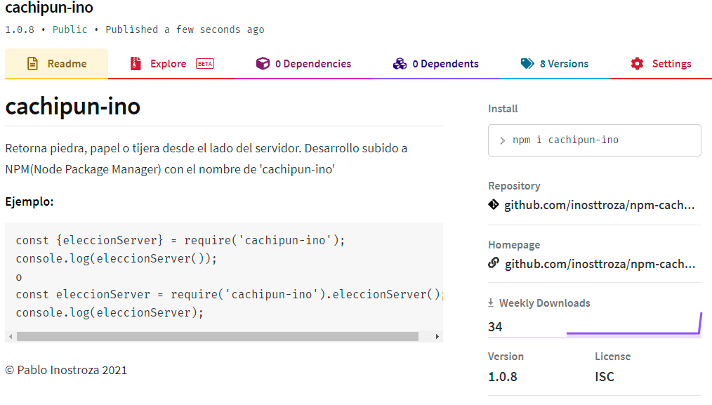

# cachipun-ino

Retorna piedra, papel o tijera desde el lado del servidor.
Desarrollo subido a NPM(Node Package Manager) con el nombre de 'cachipun-ino'


**Ejemplo:**
```
const {eleccionServer} = require('cachipun-ino');
console.log(eleccionServer());
o
const eleccionServer = require('cachipun-ino').eleccionServer();
console.log(eleccionServer);
```

© Pablo Inostroza 2021


